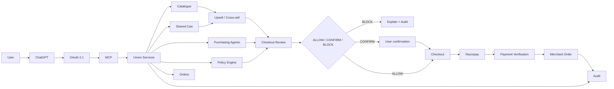

<div align="center">

# ◉ UMON

### **Agentic Commerce Infrastructure for AI Buyers**

<p>
  <strong>Make merchants discoverable, recommendable, and transactable to AI.</strong>
</p>

<p>
  <em>AI discovery · conversational shopping · merchant growth · bounded purchasing · Razorpay · auditability</em>
</p>

<br>

<table>
<tr>
<td align="center"><b>AI BUYER</b><br><sub>Understand intent</sub></td>
<td align="center">→</td>
<td align="center"><b>UMON</b><br><sub>Commerce control plane</sub></td>
<td align="center">→</td>
<td align="center"><b>MERCHANT</b><br><sub>Grow & transact</sub></td>
</tr>
</table>

<p>
  
  
  
  
</p>

</div>

---

## ✦ The idea

> **The AI can reason and request actions. Umon decides what is actually allowed to happen.**

Umon connects an AI buyer to a real merchant catalogue, shared cart, purchasing agents, recommendations, checkout, payment and audit trail—without making the language model the source of financial truth.

```text
                           UMON
                            │
        ┌───────────────────┼───────────────────┐
        │                   │                   │
        ▼                   ▼                   ▼
    Discovery            Basket             Delegation
        │                   │                   │
        └───────────────────┼───────────────────┘
                            ▼
                       Guardrails
                            │
                    ┌───────┴───────┐
                    ▼               ▼
                  BLOCK          ALLOW
                                    │
                                    ▼
                                Checkout
                                    │
                                    ▼
                                Razorpay
                                    │
                                    ▼
                         Merchant Order + Audit
```

---

## ⚡ What Umon does

<table>
<tr>
<td width="50%" valign="top">

### For AI buyers

**01 — Discover**

Natural-language shopping against the live Umon catalogue.

**02 — Understand**

Turn requests such as “paneer biryani for five” into practical shopping intent.

**03 — Recommend**

Surface relevant products and merchant-defined complementary offers.

**04 — Act**

Build a shared cart and request checkout.

**05 — Explain**

Show the product, price, agent, policy decision and final state.

</td>
<td width="50%" valign="top">

### For merchants

**01 — Become AI-readable**

Expose active offers to AI clients.

**02 — Become AI-transactable**

Control whether AI discovery, purchasing and checkout are enabled.

**03 — Grow baskets**

Use contextual upsell and cross-sell opportunities.

**04 — Stay in control**

Merchant and agent policies remain backend-enforced.

**05 — Observe**

Track orders, payments and audit events.

</td>
</tr>
</table>

---

## 🧠 The trust boundary

The model is intentionally **not** the authority for:

<table>
<tr>
<th>AI proposes</th>
<th>Umon verifies</th>
</tr>
<tr>
<td>Intent</td>
<td>Current product price</td>
</tr>
<tr>
<td>Products to consider</td>
<td>Current inventory</td>
</tr>
<tr>
<td>Cross-sell opportunities</td>
<td>Cart total</td>
</tr>
<tr>
<td>Checkout request</td>
<td>Agent ownership</td>
</tr>
<tr>
<td>Customer explanation</td>
<td>Agent balance & limits</td>
</tr>
<tr>
<td></td>
<td>Merchant AI policy</td>
</tr>
<tr>
<td></td>
<td>Payment state</td>
</tr>
<tr>
<td></td>
<td>Order state</td>
</tr>
</table>

<details>
<summary><b>Financial rule</b></summary>

If the LLM says:

```text
“Product costs ₹499”
```

but the live backend says:

```text
₹599
```

Umon uses **₹599**.

Likewise, the model cannot override a blocked category, disabled merchant, insufficient balance, transaction limit or daily spending limit.

</details>

---

## 🔌 How AI connects to Umon

```text
┌─────────────┐
│   ChatGPT   │
└──────┬──────┘
       │
       │ OAuth 2.1
       ▼
┌─────────────┐
│ Umon Auth   │
└──────┬──────┘
       │
       │ authenticated identity
       ▼
┌─────────────┐
│ Umon MCP    │
│ /mcp        │
└──────┬──────┘
       │
       ▼
┌─────────────────────────────────┐
│ Existing Umon commerce services │
│                                 │
│ catalog · cart · agents         │
│ policy · checkout · orders      │
│ audit · payments                │
└────────────────┬────────────────┘
                 │
                 ▼
              MongoDB
                 │
                 ▼
             Razorpay
```

The MCP is deliberately a **thin protocol adapter**. It should not create a second cart, wallet, payment system or policy engine.

---

## 💳 Agentic wallet / purchasing authority

A Umon purchasing agent represents **bounded delegated purchasing authority**.

```text
Grocery Agent
─────────────
Balance             ₹13,524
Per transaction        ₹700
Daily limit           ₹1,500
Category mode             ALL
Autonomous purchase       ON
```

The user controls these constraints.

The AI does not get unrestricted access to the balance.

At checkout:

```text
User cart
   ↓
Selected purchasing agent
   ↓
Live merchant policy
   ↓
Agent policy
   ↓
Price / stock / quantity
   ↓
ALLOW / CONFIRM / BLOCK
```

---

## 📈 A digital salesperson, not a spam bot

Umon's growth layer uses the shopping context to make **relevant** recommendations.

Example:

```text
User:
“I need coffee.”

Cart:
empty

Umon:
Coffee          → direct match
Milk            → complement
Sugar           → basket completion
Biscuits        → contextual cross-sell
```

After the customer adds Coffee + Milk:

```text
Coffee ✓
Milk   ✓

Re-evaluate basket
        ↓
show only the next useful opportunity
```

The system should not endlessly push products that are already in the basket.

> **The objective is useful basket growth, not maximum clicks.**

Merchant-defined complementary relationships provide stronger evidence than an unsupported LLM claim about what customers “usually” buy.

---

## 🛒 Shared cart

The cart belongs to the **user**.

```text
                 USER
                  │
                  ▼
          ┌───────────────┐
          │  SHARED CART  │
          ├───────────────┤
          │ Paneer × 1    │
          │ Rice × 1      │
          │ Masala × 1    │
          └───────┬───────┘
                  │
             checkout
                  │
                  ▼
          PURCHASING AGENT
```

This separation makes it possible to build the basket first and choose purchasing authority at checkout.

---

## 🛡️ Checkout is a hard boundary

### Review

**No money moves.**

```text
Authenticate user
      ↓
Verify agent ownership
      ↓
Verify agent status
      ↓
Verify merchant state
      ↓
Load live products
      ↓
Verify stock
      ↓
Verify current price
      ↓
Validate quantity
      ↓
Recalculate cart
      ↓
Evaluate category policy
      ↓
Evaluate merchant policy
      ↓
Evaluate transaction limit
      ↓
Evaluate daily limit
      ↓
ALLOW / CONFIRM / BLOCK
```

### Purchase

Only after explicit authorization:

```text
Validated checkout
      ↓
Idempotent order
      ↓
Idempotent payment
      ↓
Razorpay
      ↓
Authoritative payment verification
      ↓
Merchant order
      ↓
Audit
```

---

## 🚦 Failure is a feature

Suppose:

```text
Requested purchase:  ₹4,999
Agent limit:        ₹1,000
```

Umon should produce:

```text
╭──────────────────────────────────╮
│          PAYMENT BLOCKED         │
├──────────────────────────────────┤
│ Transaction exceeds agent limit. │
│                                  │
│ Payment created:       NO        │
│ Merchant charged:     NO        │
│ Audit event:          YES        │
╰──────────────────────────────────╯
```

The AI explains the reason.

The backend makes the decision.

This directly demonstrates the required Track 01 property:

> **Every money action is explainable, bounded and gated.**

---

## 🔍 Audit trail

Umon treats auditability as part of the commerce product.

```text
AI REQUEST
    ↓
TOOL CALL
    ↓
OFFER FOUND
    ↓
CART UPDATED
    ↓
POLICY CHECK
    ↓
ORDER CREATED
    ↓
RAZORPAY
    ↓
PAYMENT VERIFIED
    ↓
MERCHANT ORDER
    ↓
COMPLETED
```

Events can include:

```text
USER_LOGIN
AGENT_CREATED
AGENT_POLICY_UPDATED
MCP_CONNECTED
OFFER_VIEWED
OFFER_SELECTED
CART_CREATED
ITEM_ADDED
POLICY_CHECK
POLICY_ALLOWED
POLICY_BLOCKED
ORDER_CREATED
PAYMENT_CREATED
PAYMENT_SUCCEEDED
PAYMENT_FAILED
PAYMENT_WEBHOOK
MERCHANT_ORDER_CREATED
MERCHANT_ORDER_CONFIRMED
CHECKOUT_CANCELLED
```

A useful audit record should answer:

| Field | Meaning |
|---|---|
| Actor | Who initiated it |
| Action | What happened |
| User | Which user |
| Agent | Which purchasing agent |
| Merchant | Which merchant |
| Order | Which order |
| Amount | How much |
| Reason | Why |
| Result | Outcome |
| Timestamp | When |
| Correlation ID | Which request flow |

---

## 🖼️ MCP App UI

Umon exposes visual commerce surfaces:

```text
ui://umon/store.html
ui://umon/cart.html
ui://umon/checkout.html
ui://umon/order.html
```

The UI follows a compact, mobile-friendly commerce style:

```text
┌────────────────────────────────────┐
│ U Umon Mart                 3 items│
├────────────────────────────────────┤
│                                    │
│ [image]  Milky Mist Paneer         │
│          200 g · Dairy              │
│          ₹80              [ Add ]   │
│                                    │
│ [image]  Basmati Rice              │
│          5 kg · Grocery             │
│          ₹250             [ Add ]   │
│                                    │
└────────────────────────────────────┘
```

The goal is to expose the important commerce information without forcing users through huge dashboard cards.

---

## 🧩 Technology stack

<table>
<tr>
<td><b>Frontend</b></td>
<td>Next.js · TypeScript · Tailwind CSS · Clerk</td>
</tr>
<tr>
<td><b>Backend</b></td>
<td>FastAPI · Python · Pydantic · MongoDB</td>
</tr>
<tr>
<td><b>AI</b></td>
<td>LangGraph · configurable Groq/LLM layer</td>
</tr>
<tr>
<td><b>AI connectivity</b></td>
<td>FastMCP · MCP Apps · OAuth 2.1</td>
</tr>
<tr>
<td><b>Payments</b></td>
<td>Razorpay test mode</td>
</tr>
<tr>
<td><b>Auth</b></td>
<td>Clerk + authenticated MCP context</td>
</tr>
<tr>
<td><b>Commerce state</b></td>
<td>MongoDB</td>
</tr>
</table>

---

# 🏗️ Architecture



---

# 📁 Repository structure

```text
UMON/
│
├── backend/
│   ├── app/
│   │   ├── config.py
│   │   ├── db.py
│   │   ├── models.py
│   │   ├── schemas.py
│   │   ├── security.py
│   │   ├── services.py
│   │   ├── payments.py
│   │   ├── policies.py
│   │   ├── audit.py
│   │   ├── langgraph_agent.py
│   │   ├── mcp.py
│   │   ├── routes.py
│   │   ├── main.py
│   │   └── ui/
│   │       ├── store.html
│   │       ├── cart.html
│   │       ├── checkout.html
│   │       └── order.html
│   │
│   └── ...
│
├── frontend/
│   ├── app/
│   ├── src/
│   │   └── lib/
│   │       └── api.ts
│   ├── package.json
│   └── ...
│
└── README.md
```

---

# 🔧 Local development

## Backend API

```bash
cd backend
uvicorn app.main:app --reload --port 8001
```

## MCP server

```bash
cd backend
python -m app.mcp
```

Example local MCP configuration:

```env
MCP_PUBLIC_URL=http://localhost:8002
```

MCP endpoint:

```text
http://localhost:8002/mcp
```

## Frontend

```bash
cd frontend
npm run dev
```

---

# 🔐 Environment variables

Create a local `.env`.

```env
MONGODB_URI=
JWT_SECRET=

GROQ_API_KEY=
GROQ_MODEL=

RAZORPAY_KEY_ID=
RAZORPAY_KEY_SECRET=
RAZORPAY_WEBHOOK_SECRET=

IMAGEKIT_PUBLIC_KEY=
IMAGEKIT_PRIVATE_KEY=
IMAGEKIT_URL_ENDPOINT=

NEXT_PUBLIC_API_URL=
UMON_FRONTEND_URL=
MCP_PUBLIC_URL=
UMON_WIDGET_DOMAIN=
```

Never commit real credentials.

---

# 🤝 Connecting Umon to ChatGPT

The target flow is:

```text
1. Open Umon
2. Connect Umon to ChatGPT
3. Authenticate with a Umon account
4. Approve the connection
5. ChatGPT receives the authenticated MCP context
6. Ask Umon to shop
```

The authenticated identity determines which:

- cart
- agents
- orders
- audit events

the AI can access.

Agent ownership must always be checked server-side.

---

# 🧪 Recommended end-to-end test

Use a real shopping intent.

### Prompt 1 — discovery

> **I'm making paneer biryani for 5 people. Check Umon Mart's live catalogue and tell me which ingredients I need and which are actually available. Build a practical shopping list, but don't add anything or buy anything yet.**

### Prompt 2 — basket

> **Add the paneer, basmati rice, biryani masala and the other available core ingredients to my Umon cart.**

### Prompt 3 — merchant sales

> **Now inspect my basket and suggest the most useful complementary products I haven't added yet. Only recommend products that Umon actually has available.**

### Prompt 4 — guardrail

> **Review checkout using my Grocery Agent. Don't pay yet. Show me the exact total, agent balance, transaction limit and daily remaining amount.**

### Prompt 5 — purchase

> **The cart is within my agent limits. Purchase it using my Grocery Agent.**

### Prompt 6 — order

> **Show my latest Umon order.**

---

# 🎬 Five-minute judging demo

<table>
<tr>
<th>Time</th>
<th>Demo</th>
<th>What it proves</th>
</tr>
<tr>
<td>00:00</td>
<td>Umon purchasing agent</td>
<td>Delegated money with limits</td>
</tr>
<tr>
<td>00:40</td>
<td>Agent guardrails</td>
<td>Bounded AI authority</td>
</tr>
<tr>
<td>01:15</td>
<td>Connect Umon</td>
<td>Authenticated AI access</td>
</tr>
<tr>
<td>01:45</td>
<td>Paneer biryani prompt</td>
<td>Natural-language shopping</td>
</tr>
<tr>
<td>02:15</td>
<td>Live product UI</td>
<td>AI-readable merchant catalogue</td>
</tr>
<tr>
<td>02:40</td>
<td>Add products</td>
<td>Shared cart interaction</td>
</tr>
<tr>
<td>03:10</td>
<td>Cross-sell</td>
<td>Merchant revenue growth</td>
</tr>
<tr>
<td>03:45</td>
<td>Checkout review</td>
<td>Policy enforcement</td>
</tr>
<tr>
<td>04:05</td>
<td>Intentional BLOCK</td>
<td>Graceful failure</td>
</tr>
<tr>
<td>04:25</td>
<td>Successful purchase</td>
<td>End-to-end commerce</td>
</tr>
<tr>
<td>04:50</td>
<td>Order + audit</td>
<td>Completion + traceability</td>
</tr>
</table>

---

# 🏆 Track 01 alignment

| Requirement | Umon |
|---|:---:|
| AI-readable catalogue | ✅ |
| Conversational shopping | ✅ |
| Conversational checkout | ✅ |
| Agent guardrails | ✅ |
| Delegated purchasing authority | ✅ |
| Upsell / cross-sell | ✅ |
| Merchant AI controls | ✅ |
| Razorpay integration | ✅ |
| Merchant order | ✅ |
| Auditability | ✅ |
| Explainable failure | ✅ |
| MCP / AI buyer connection | ✅ |
| Visual AI commerce UI | ✅ |

---

# 🧭 Design principles

### 01 — Backend truth

If the model and backend disagree:

> **Backend wins.**

### 02 — Recommendations are not payments

An AI suggestion does not equal financial authorization.

### 03 — User control

The user should always understand what is being purchased and why.

### 04 — Merchant value

Cross-sell should be contextual and useful.

### 05 — Safe failure

A policy block with zero money movement is a successful safety outcome.

### 06 — Thin protocol layer

MCP exposes Umon capabilities; it does not duplicate commerce logic.

---

# 🚀 Scope

The project deliberately focuses on the core agentic-commerce problem:

```text
AI DISCOVERY
+
CONVERSATIONAL CHECKOUT
+
AGENT GUARDRAILS
+
UPSELL / CROSS-SELL
+
RAZORPAY
+
MERCHANT ORDER
+
AUDITABILITY
```

It does not attempt to become a:

```text
multi-chain platform
crypto wallet
full ERP
complex accounting system
large campaign automation suite
universal payment platform
```

---

# 📜 Definition of done

The complete flow should be demonstrable:

```text
User account
   ↓
Merchant account
   ↓
AI-buyable offer
   ↓
Purchasing agent
   ↓
Agent policy
   ↓
MCP connection
   ↓
AI discovery
   ↓
Product selection
   ↓
Cross-sell
   ↓
Shared cart
   ↓
Checkout validation
   ↓
Policy decision
   ↓
Order
   ↓
Razorpay test payment
   ↓
Payment verification
   ↓
Merchant order
   ↓
Audit trail
```

And important failure paths should remain safe:

```text
price changed
stock changed
quantity changed
agent disabled
merchant AI disabled
transaction limit exceeded
daily limit exceeded
insufficient balance
duplicate checkout
payment failure
payment timeout
payment unknown
webhook problem
merchant confirmation problem
```

---

<div align="center">

### ◉ UMON

**The merchant becomes an API for the AI buyer.**

<sub>
Reason with AI. Verify with Umon. Transact with guardrails.
</sub>

</div>
